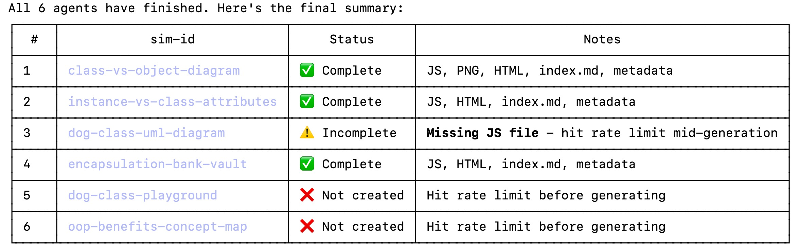

# Parallel Execution of Tasks

Claude Code now allows you to executes tasks in parallel.
The good news is that you can now generate ALL the content
of all the chapters in your entire 12 chapter book in 1/12th
the time it used to take you.  The bad news is that if
you choose the parallel option your tokens will run out 38%
faster.

## Why Parallelism?

## Pros of Parallel Task Execution

When you are not having problems with rate limits the tasks finish much faster.
The exact speedup depends on how many tasks run in parallel.  I have seen
speedups of 6x for some projects.

## Cons of Parallel Task Execution

There several big negatives:

1. Much less token efficient (38% lower in my tests)
2. Lost work when tasks fail due to rate limits
3. Reliability
4. Lack of visibility

When you hit a rate limit, much of your work will be lost.

- 3 of 6 agents completed before the rate limit hit, 1 was partial (missing JS), 2 failed completely                                    
  - 50% of deliverables required full manual rework by the parent agent
  - ~780 lines of JavaScript had to be written manually vs. ~1,350 written by agents                                                      
  - The most complex sim (dog-class-playground) was among the failures — rate limits disproportionately affect token-heavy tasks
  - The partial failure (dog-class-uml-diagram) was arguably worse than total failure — it left wrong metadata (Geometry instead of CS)
  with TODO placeholders but no actual JS file

  Each parallel agent is an independent subprocess with its own context. That means the fixed overhead gets multiplied by N:              
                                                                                                                                          
  Per-agent overhead (paid 6 times in parallel, once in serial):                                                                          
  - System prompt + safety rules (~5k tokens)
  - CLAUDE.md + project CLAUDE.md (~3k tokens)                                                                                            
  - Skill tool invocation → microsim-generator prompt expansion (~2-4k tokens)                                                            
  - Reading reference files (existing sims for style matching, chapter content) — each agent independently reads the same files (~5-10k   
  tokens)

  Rough math:
  - Fixed overhead per agent: ~15-20k tokens
  - Actual generation work: ~30-40k tokens
  - Parallel total: 6 × 50-60k = 300-360k tokens
  - Serial total: 20k (one-time overhead) + 6 × 35k (generation with shared context) = 230k tokens

  The other factor: parallel agents can't learn from each other. If agent 1 reads class-vs-object-diagram.js to understand the project's
  MicroSim pattern, agents 2-6 independently read the same file and spend tokens on the same discovery. In serial execution, that
  knowledge stays in context and is reused for free.

  So parallel is faster in wall-clock time but ~30-50% more expensive in tokens — which matters a lot when you're near a rate limit. In
  this session, the extra token consumption from 6 simultaneous agents is likely what pushed us over the limit in the first place.

